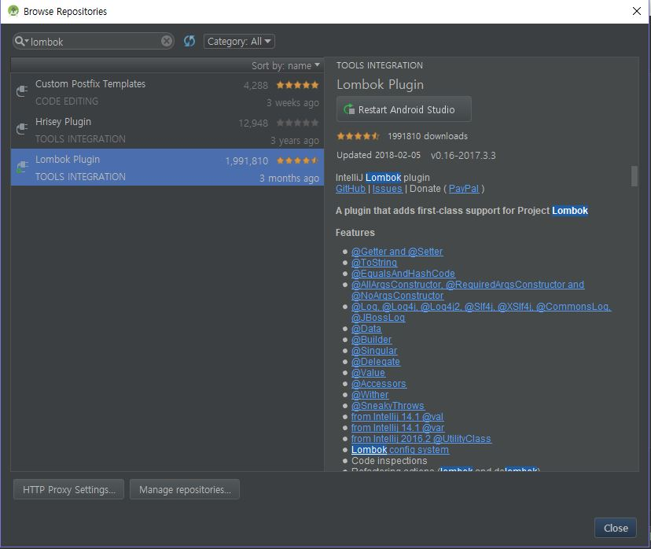
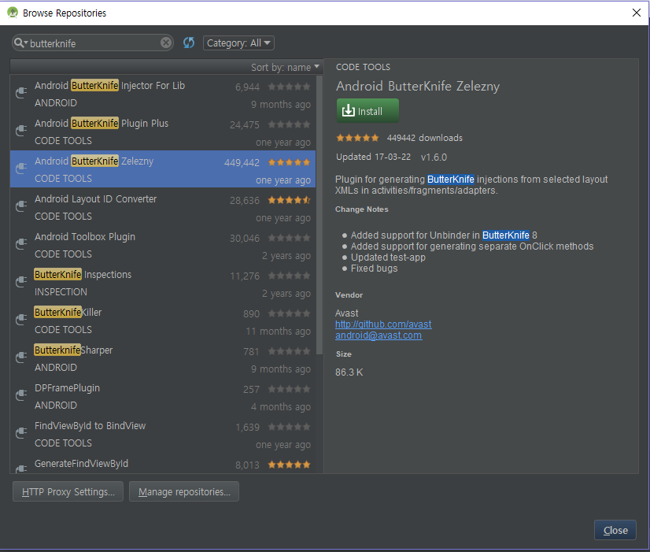
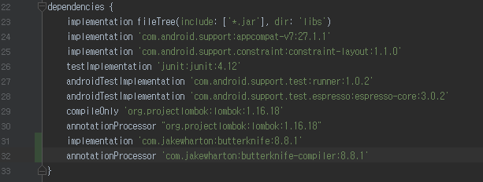

## ServersCenter Android Repository

이 저장소는 ServersCenter의 Android App Source를 관리하기 위한 저장소입니다.

데이터 서버와 통신하여 챗봇 기능을 구현할 계획입니다.

#### 사용 라이브러리

* Lombok
* Butter Knife

*****

## GitLab-Flow


* master: 개발 브랜치
* pre-production: 테스트 브랜치 (배포 준비)
* production: 배포 브랜치


*****

## Lombok 설치 및 설정



plugin 설치 후 모듈 레벨의 build.gradle의 dependency에 다음 라인을 추가한다.

```
compileOnly "org.projectlombok:lombok:1.16.18"
annotationProcessor "org.projectlombok:lombok:1.16.18"
```

*****

## Butter Knife 설치 및 설정



plugin 설치 후 모듈 레벨의 build.gradle dependency에 아래 두 라인을 추가한다.



'package javax.annotation does not exist' 에러 발생 시에 아래 코드를 gradle dependency에 추가한다.

```
provided 'org.glassfish:javax.annotation:10.0-b28'
```